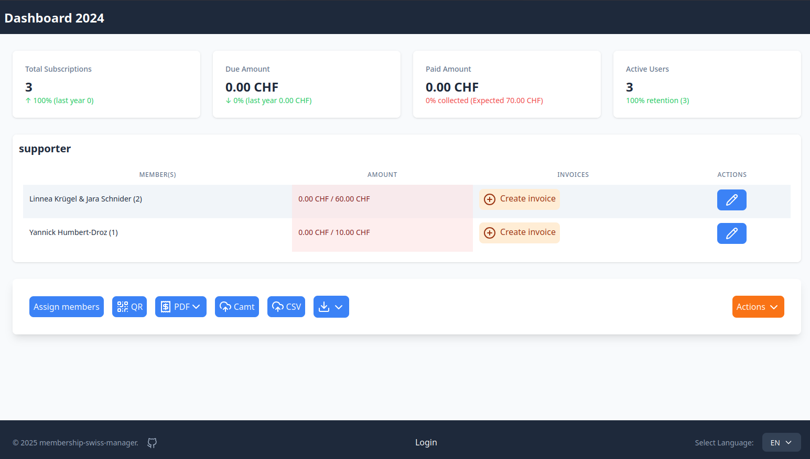
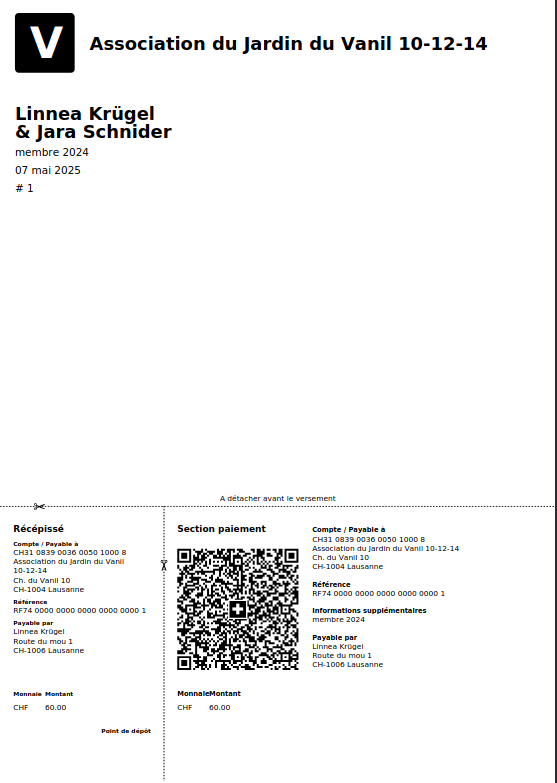
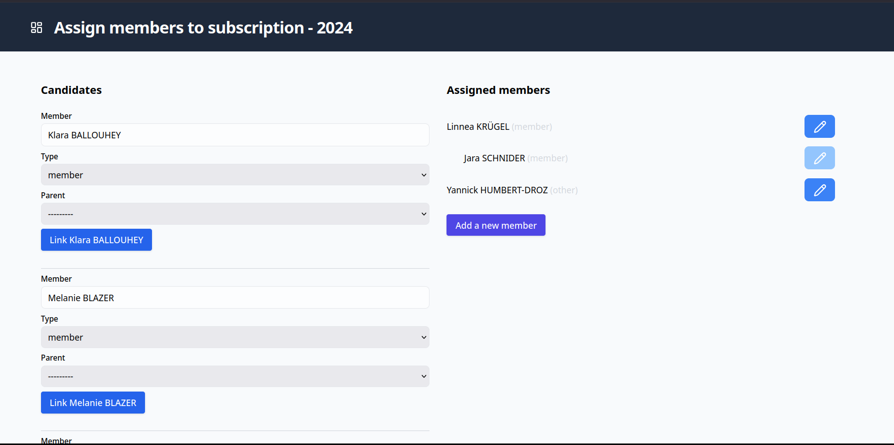

# Manage yearly subscription

GOAL: Assign users to a subscription plan, and manage the billing process.

I switched from Symfony to Django at work, and this project is just a playground to learn Django.

## Features

- Assign users to a subscription plan
- Generate invoices as PDFs (you can then send the invoices yourself or print them)
- Import a CAMT file to update the status of the invoices
- Overview of the subscription plans (and export)
- Use sqlite as a database engine (can easily be changed)

## Limitations
- Prices are hardcoded
- Only one Account is configurable
- Test are not implemented (yet)

## Setup

- Have `docker compose` installed as requirement (and traefik ideally)
- Copy `.env.example` to `.env` and set the environment variables.
- Copy `docker-compose.override.yaml.example` to `docker-compose.override.yaml` and set the environment variables.
- Run `exec INITIAL=1 docker compose up -d` to start and initialize the containers.

### Backups

The database is stored into `./data/db/`. 

There are some helpers to backup or restore the database using `rclone`. See `./bin`

## Demo

You can import the fixture like that:
- Set `DB_ENV=test` 
- Run `manage.py fixturize --db test` commands to create the initial data.

### Preview

