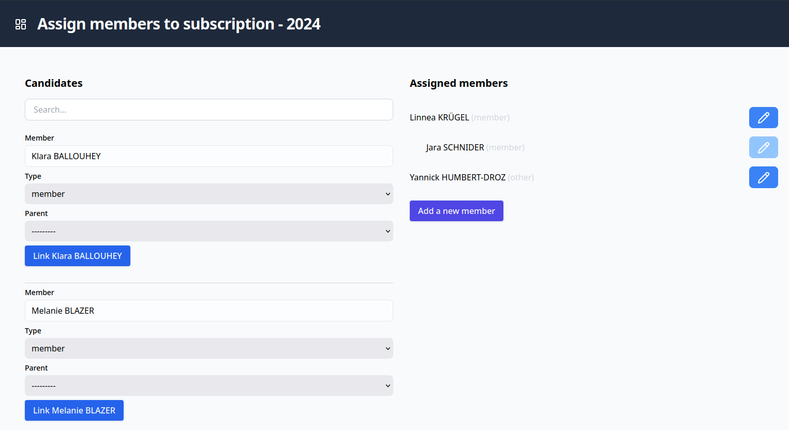

# Manage subscriptions / memberships

I switched from Symfony to Django at work, and this project is just a playground to learn Django.

GOAL: Assign members to a subscription plan and manage the billing process.

> This project is used to manage a community garden where members pay for a plot.

There are currently two types of registration:
- As a member: You paid the subscription fee
- Other: You paid a donation (or you are a sponsor)

I create one subscription plan per year, but there is no limitation.

You can group member's registration together, so only one member will be billed for the whole group.

## Features

- Assign users to a subscription plan
- Generate Swiss invoices as PDFs (you can then send the invoices yourself or print them)
- Import a CAMT file to update the status of the invoices
- Overview of the subscription plans (and export)
- Use sqlite as a database engine (can easily be changed)

## Limitations
- Currency is hardcoded as "CHF", the price can be configured in the admin interface for each subscription plan
- Only one Account is configurable for Billing (the one used to generate the invoices)
- Test are not implemented (yet)
- We expect a reverse proxy (traefik, Caddy, nginx, etc) to use HTTPS.
- There is no authentication in the app currently, use the reverse proxy to handle authentication. 

## Setup

- Have `docker compose` installed as requirement (and traefik ideally)
- Copy `.env.local.dist` to `.env.local` and set the environment variables.
- Copy `compose.override.example.yaml` to `compose.override.yaml` and set the environment variables.
- Run `env INITIAL=1 docker compose up -d` to start and initialize the containers.

### .env.local variables overview
| Variable | Description                                                                                                                      |
|----------|----------------------------------------------------------------------------------------------------------------------------------|
| SECRET_KEY | Secret key to generate <https://djecrety.ir/>                                                                                    |
| IBAN | Iban to generate invoices                                                                                                        |
| CUSTOMER_IDENTIFICATION_NUMBER | A 6-digit number identifying the bank or financial institution that issued the QR-IBAN. It's part of the Swiss Payments Standard |
| LANGUAGE | Language to use for the QR code in invoices.                                                                                     |
| CREDITOR_NAME | Name for the invoice                                                                                                             |
| CREDITOR_ADDRESS | Address for the invoice                                                                                                          |
| CREDITOR_ADDRESS_HOUSE_NUMBER | House number for the invoice                                                                                                     |
| CREDITOR_ZIP | Zip for the invoice                                                                                                              |
| CREDITOR_CITY | City for the invoice                                                                                                             |
| CREDITOR_COUNTRY | Country for the invoice                                                                                                          |
| ALLOWED_HOSTS | List of allowed hosts for the Django application.                                                                                |

It's just the most important ones. Check the .env and settings.py for more variables.

Please note that you need to reload your containers to apply the changes in the `.env.*` files.

### Backups

The database is stored into `./data/db/` (mounted as a volume)
There are some helpers to backup and restore the database using `rclone` from outside the container. See scripts in `./bin`.

### Updates
- Run `docker compose pull` to update the base images
- Run `docker compose up -d --build` to update the containers
- Run `docker compose exec web python3 manage.py migrate` to update the database schema

## Demo

You can import the fixture like that:
- Set `DB_ENV=test` in your `.env.local` file
- Run `manage.py fixturize --db test` commands to create the initial data.

### Preview

